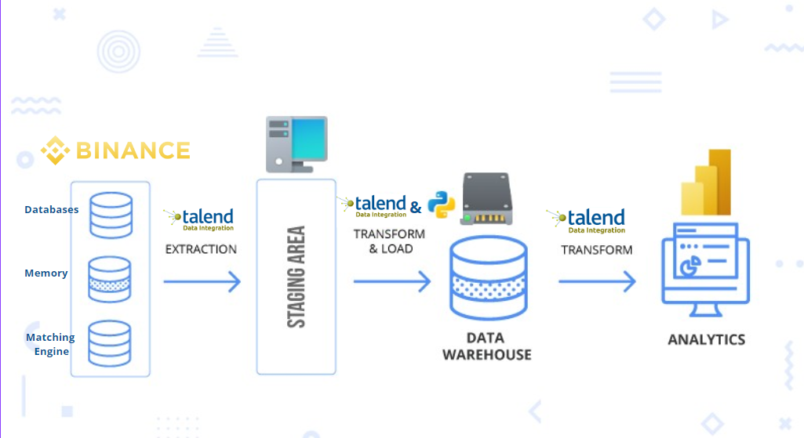
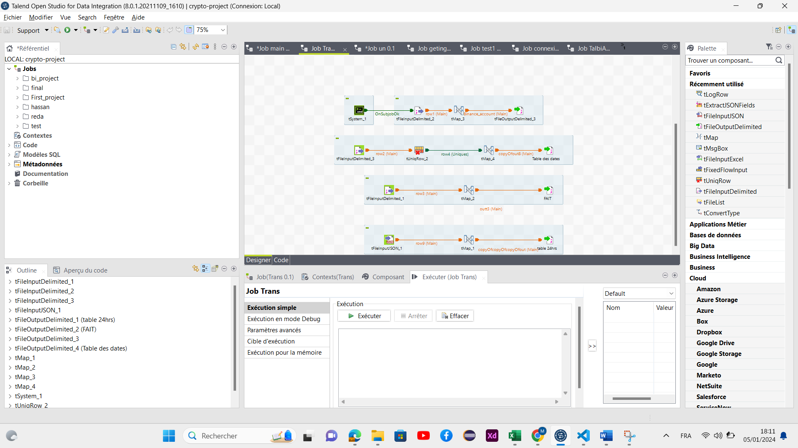
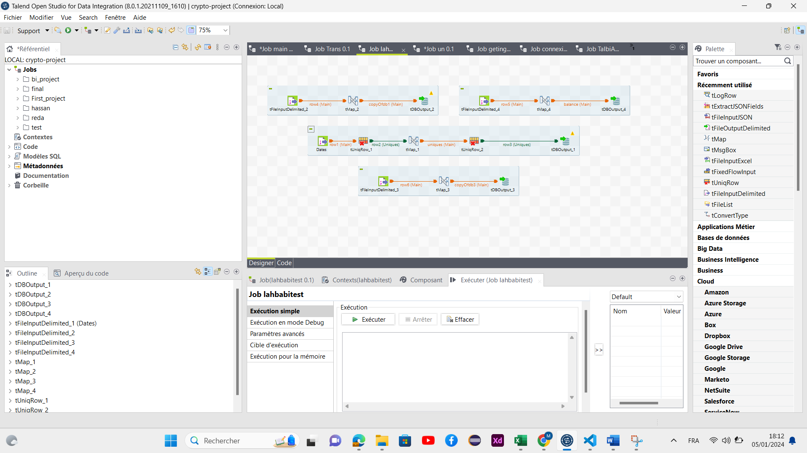
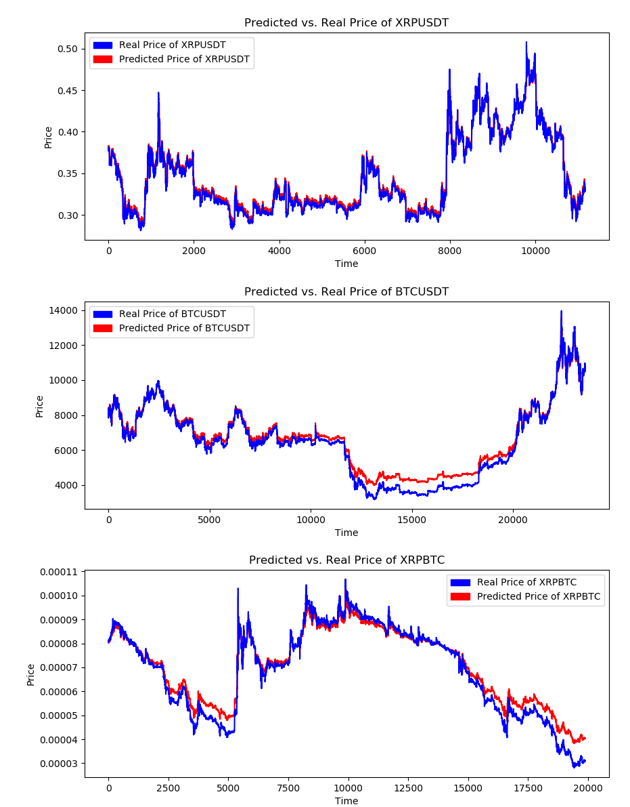

# Implémentation d'une solution ETL pour l'intégration de données de l'API Binance sous Talend

## About The Project
Ce projet consiste à implémenter une solution ETL (Extract-transform-load) sous **Talend Open Studio** pour une intégration de différentes sources de données depuis l'API de binance et notamment avec des scripts en **Python**, les taches à réaliser sont :

- Implémenter des jobs
- Réaliser des mapping avec les flux de données
- Orchestrer plusieurs jobs et créations des routines pour transformation de données
- Intégration de de la base de données : **MYSQL**
- Définition des schémas de métadonnées
- Automatisation avec des scripts exécutable
- Gestion des grosses sources de données (**Big Data**)

#### Context

- Migration de données à un nouveau système
- Stockage de données dans des entrepôts de données
- Consolidation de données (fusion d'entreprises)
- Synchronisation de données à temps réelle
- Lectures de différents DBs ou fichiers (csv, json, xlsx)
- Intégration décisionnelle et opérationnelle

#### Keywords

Talend  - Python - Jobs - Talend Open Studio - ETL - Crypto - Cryptocurrency -

#### Schematic

#### Data Set

***klines :***
    •	Open/High/Low/Close : Prix à différents moments.
    •	Volume : Montant de l'actif échangé.
    •	Number of Trades : Nombre total de trades dans la bougie.
***Dates :***
    •	Date : toutes les dates de close price de 8ans dernière .
    •	Year : l'année de la date.
    •	Month : le mois de la date.
    •	Day : le jour de la date.
    •	Hour : l'heure de la date.
***24hrs :***
    •	symbol : Symbole de la paire de trading (par exemple, ETHBTC).
    •	priceChange : Changement de prix au cours des dernières 24 heures.
    •	priceChangePercent : Pourcentage de changement au cours des dernières 24 heures.
    •	lastPrice : Dernier prix négocié.
    •	volume : Volume total échangé au cours des dernières 24 heures
***balance :***
    •	Asset : le nom de la symbol de notre wallet.
    •	Free : Total de quantité de l'asset libre pour l'échange.    
    •	Lock : Total de quantité de l'assets bloquées de  l'échange.

#### Diagramme en étoile 

#### Jobs

Jobs | Composant_Inputs | Composant_Outputs | Description du job                                     |
|-----------------|-----------------|----------------------------------|---------------------------------------------|
| Getting Data |TrestClient or the endpoints : **/api/v3/klines**   **/api/v3/ticker/24hr**   **/api/v3/account** | [24hr.json](24hr.json)   [binance_account_info.json](binance_account_info.json)   [path ./jsonfiles_klines/](./jsonfiles_klines/BTCUSDT.json) | Getting the Data from binance API f|
| Transformation des données | [24hr.json](24hr.json)   [binance_account_info.json](binance_account_info.json)  [Allklines.json](./csvfiles_klines/allklines.csv)   [file_for_dates.csv](/output_files.csv)| [balance.csv](balances.csv)   [klines.csv](./final/Faitklines.csv)  [dates.csv](./final/dates.csv) [24hr.csv](./final/24hr.csv)| The transformation phase involves transforming, cleaning, and normalizing our data.|
| Saving in the staging erea | [balance.csv](balances.csv)   [klines.csv](./final/Faitklines.csv)  [dates.csv](./final/dates.csv) [24hr.csv](./final/24hr.csv)| [Our BD](/projet_crypto.sql)| Alimentation de la table BD MYSQL `klines` and `dates` and `24hr` `balance` à partir des fichiers csv|
| Main | All Jobs | TmessageBox | Execution des de processus  |

#### Visualisation des processus : 

- Job Getting Data :

- Job Transformation des données :

- Job Saving in the staging erea :

- Job Main :

#### Visualisation Power Bi

#### Prediction 

